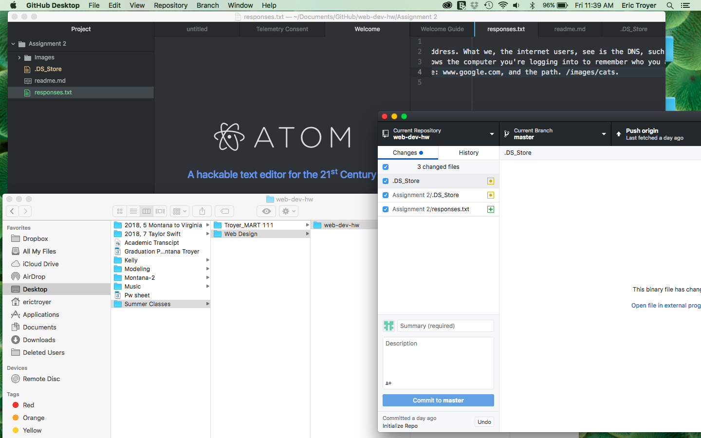

# Assignment 2
*Version Control System* tracks your history of changes, spelling, creation, color, etc. It also allows you to make changes on a document while another person is using it and it tells you who did each change. This class is using it, so students can look at their own change history, try new things, and if that doesn't work go back to what we originally had.

[Responses](./responses.txt)

