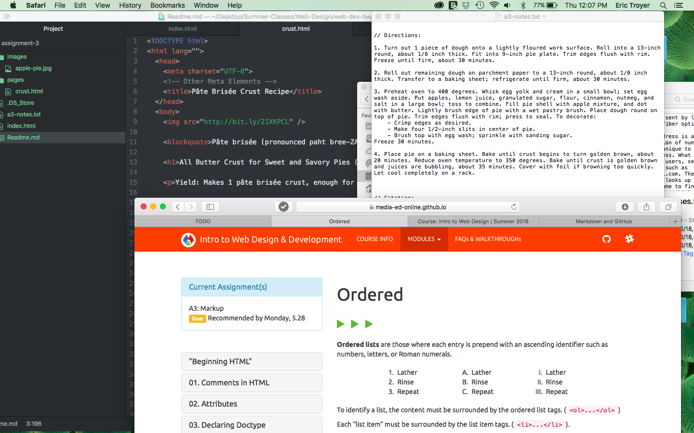

# Assignment 3
The head of the site is where important information that is not visible to the viewer is places, such as author, publication date, etc. The body is all the data visible by the viewer. A page can have only one head and one body element.

Structural markups are used to create organization in a document, such as bullet points or other types of lists. Semantic markups are used to create emphasis on a work, such as bolds or italics.

Ever since I've gotten used to the program, everything seems to be going well. I didn't have any huge problems. On your link of the crust recipe, I have troubles getting the link to reconnect to the page I created. However, when I did what you did and put two periods in front of it, instead of one, it worked. All your examples on the pictures and examples on the page really help me. I don't have great reading skills, so half the time when I'm reading the text you put up, it doesn't make sense to me. Copying what the images are doing is much better for me. This homework cycle, I didn't put anything on the issues board. I still don't quit understand how that works. Do we have to add to that to get participation points? As you already know, I'm not the type of person who likes putting my problems out there for everyone to solve and I don't know enough to help other people out.

