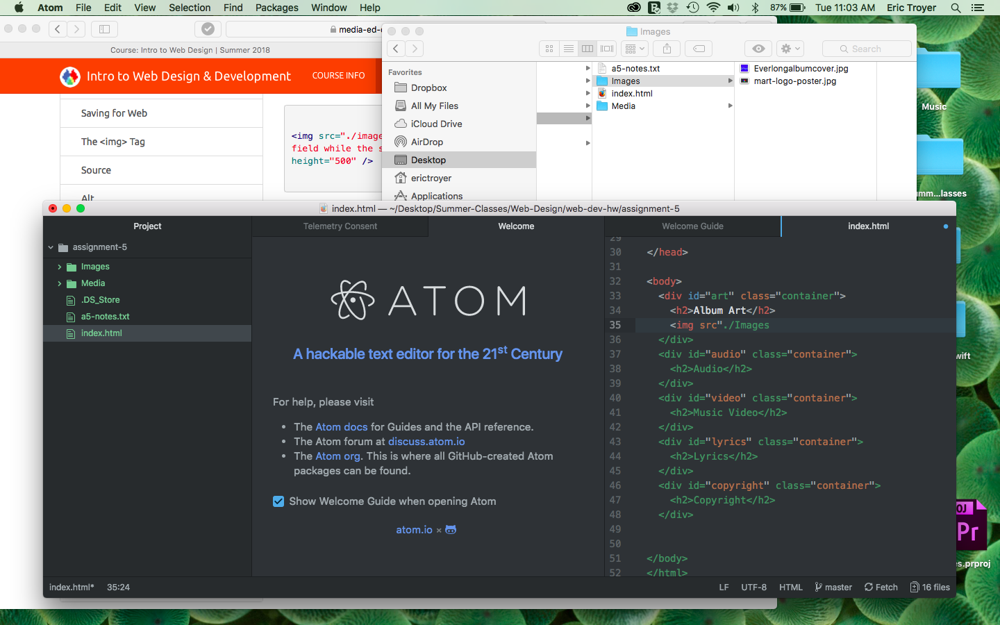

# Assignment 5 Read Me
Divs - Allows the developer to group many elements together
class - a more broad description of the element that allows the program to group certain similar elements together
Id's - brief description of the element that makes it different from the rest of the elements on the page.
Spans - Allows the developer to group elements together that need extra styling and organization.

Third party hosting is a lot quicker and simpler.

Everything went pretty smoothly for this assignment I thought. I used my last project to remind myself what the 4 main document elements are. I used your visuals in the lesson to guide me through creating the div elements. For the third party hosting part, it took me a bit to find the embedded information. I didn't understand that at first, but after watching your tutorial video several times, I found it.

 
