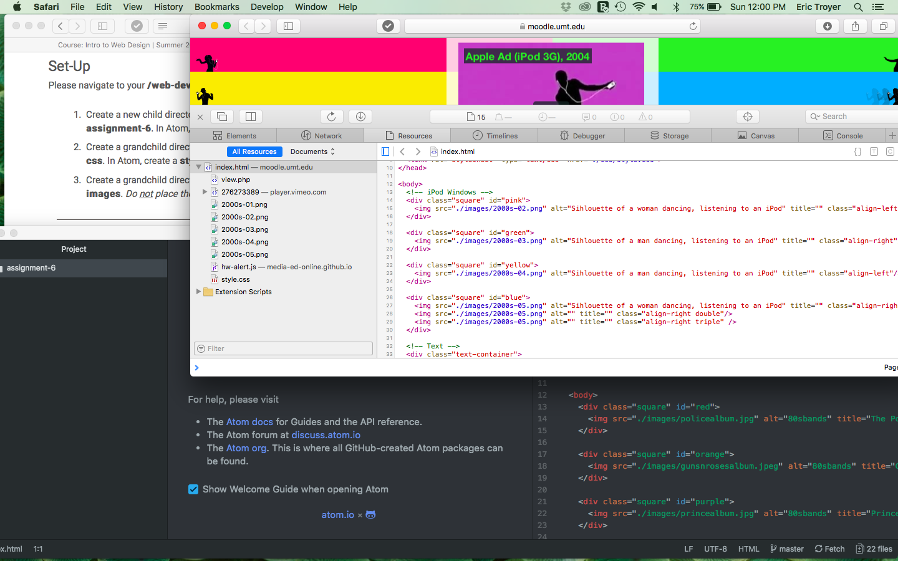

# Assignment 6 Read Me

I chose to go with graphics designs for music in the 80's. I chose those red orange and blue, because they were colors that were prominent in the album covers I chose. I chose purple for Prince, because Prince did an album titled Purple Rain.

My color palette includes a shade of orange, red, purple and blue.
Red: #b3240c
Orange: #f56f0c
Purple: #510458
Blue: #200676

I also had white and black for the background and text.

As usual, I was very confused the whole time. So, first, I didn't really understand what you wanted. Your example helped explain it, but I was still very confused. I then decided to try to mimic something that looked like yours, but had my own style to it. I went with 80's music, because music has always been a huge part of my life. So, I chose my album covers, colors, and quote that I was going to use. I tried using the same coding on yours and changing it a bit to see if it looked similar. It did not. I opened the page and everything was messed up. After hours of being confused and frustrated, I figured it it was because in the style.css, I did not end two phrases with a semi-colon. After figuring that out, the rest of the project went pretty smoothly.

