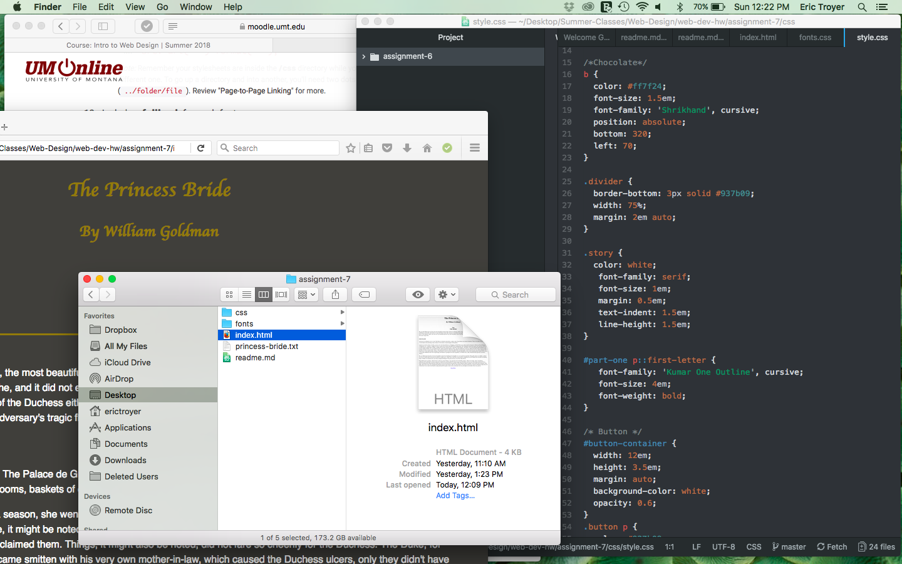

# Assignment 7 Read Me

Princess Bride is an old fashioned style movie with sword fights and horseback riding, so I wanted something that would fit that. I looked at different book covers and fonts and chose a wavy font. I also wanted a font that was easily readable for the text, but still a little old fashioned. The fonts I ended up with were Roboto and Dancing Script.

System fonts are fonts already on the device or system being used. Web fonts are fonts that are hosted on a server. Web-safe fonts are fonts that the designer can know will be available by the system.

Fallback fonts are important, because if one web browser doesn't support one of the fonts it can replace the font with your fallback font rather than someone random font in it's database.

For this assignment, I was able to figure out most of it. I looked at your coding and example codings from the class page and it seemed to fall into place pretty nicely. My main struggles in this project were the fallback fonts and the button. I still have no idea if I coded the fallback fonts correctly. At one point I deleted everything that I had in the font.css and absolutely nothing in the web page changed which makes me believe I'm missing a huge step. With the button, every time after I clicked it, there were weirded dotted outlines that would show up. I couldn't figure out where that was coming from. I just left it in, because I have no idea what's causing it.

