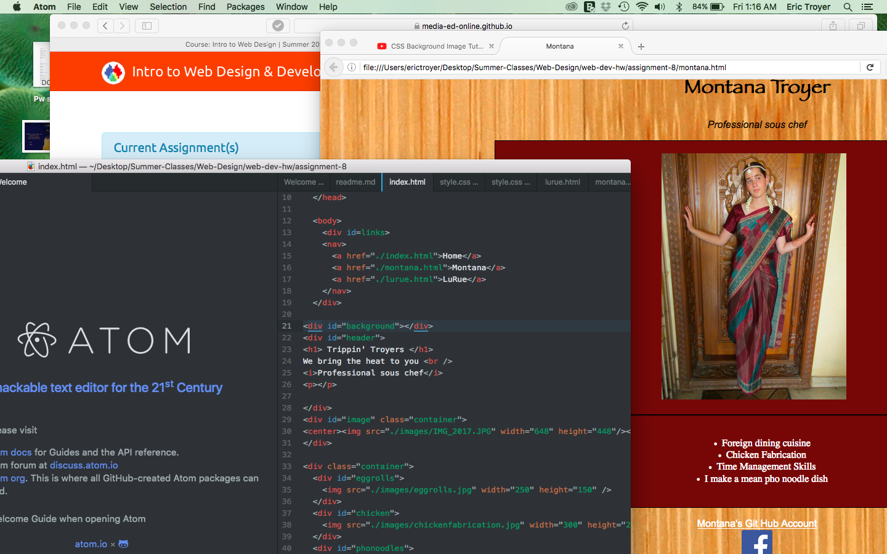

# Assignment 8 Read Me

Padding- padding is the spacing between the inner elements and the border.
Margin- margins are the spaces between the box and other elements around it.
Border- borders are the outlines around the containers

The hardest part of the assignment was change the background image. I tried many different routes and none of them worked. However, I watched a youtube video which got me to where I have it now.  

I started out taking this project seriously, but the website ended up super boring, so I decided to take a different route and come up with a persona that wasn't actually me (aka a chef). It made the assignment more fun. I first got everything down on each page that I wanted to. Images, specialties, containers, etc. Then I tried to make the pages look nicer, such as changing the fonts, backgrounds, arrangements and adding hover over the navigation menu. Then, I went through the assignment page to see what I was missing and filled in the blanks.

The main problems I had were changing the background, adding an outline to the containers and arranging the images. The way I found most helpful to solve these problems were looking up videos and watching other people do them. It was very helpful for me to watch other people use the program and then follow their steps.

I had a problem with arranging the pictures too where, when I open the site in my file on my computer it looks fine. However, when I downloaded the site and opened it as https://montanatroyer.github.io/web-dev-hw/assignment-8/
the images are NOT how they were supposed to be positioned.

