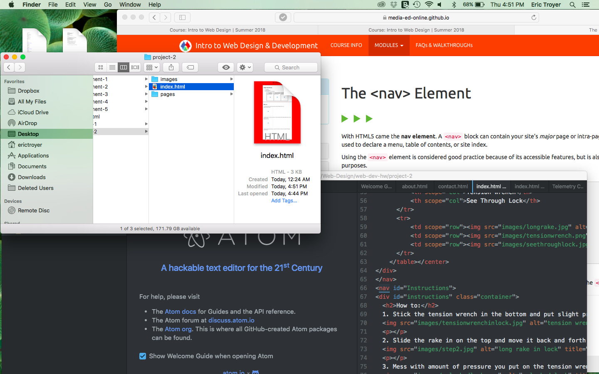

**Project 2 Read Me**

HTML was extremely difficult to learn. I have no experience in web design at all, so it feels like I'm diving into the deep end with no experience in swimming. Some parts have been interesting, but mostly it's extremely stressful learning something completely new with no one to go ask in person what I'm doing wrong.

It'll be nice to be able to add some flare to our websites to make them ours, but once again I'm mostly stressed because I have no idea what I'm going to be diving into.

So, this project was a lot more difficult than the recent ones.My first problem I had was when I was creating the style for the index.html, I forgot to end the style, so nothing I was typing was showing up on the page and I couldn't figure out why. Next, I tried to create containers for my index.html and those weren't showing up. I started moving the style section of containers around and eventually something happened. I'm not sure what I did right though. Things went pretty smoothly until I had to connect the pages, which I solved by messing around with the organization and text and eventually I solved it.

I learned in this lesson that you can look at what other students have done and how they coded it, so I used that a lot which really, really helped me.

  
